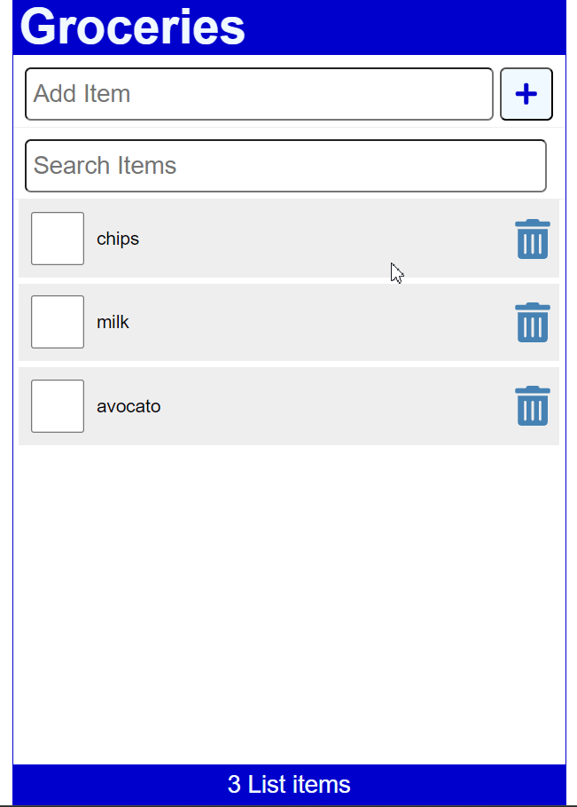

# Learning React by building a grocery list

## Setup
Open the terminal at the root of the app and run the following command

- "npx json-server -p 3500 -w data/db.json" to simulate server using db.json file
  
In a separate terminal window run (also at root)
- "npm install" to install dependencies
- "npm start" to run the app in react

